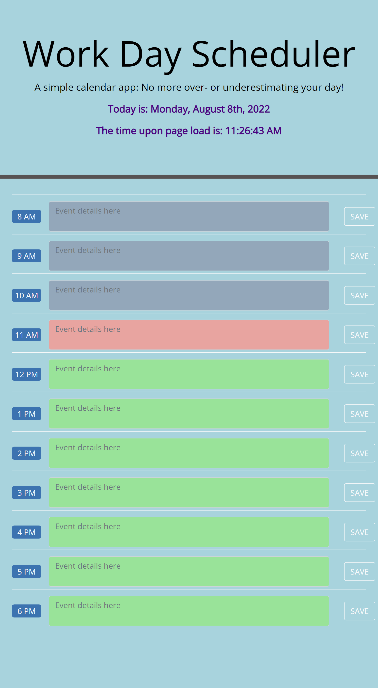

# Work Day Scheduler
Manage each hour of your day with this simple scheduler!

## Table of Contents

- [Description](#description)
- [Deployed Application](#deployed-application)
- [Installation](#installation)
- [Usage](#usage)
- [Credits](#credits)
- [License](#license)

## Description

This app is an easy and straightforward way to layout the work day. With the current date automatically at the top of the page, you can see the hours in dedicated blocks of time that allow you to elaborate on event details and then save those details. Powered by JavaScript, jQuery, Bootstrap and moment.js, this is an app with a clean interface that will allow users to enjoy scheduling.

## Deployed Application

https://miss-mad.github.io/what-a-day/

## Installation

No installation necessary.

## Usage

Below are screenshots of the Horiseon webpage. Visually, it will look very similar, but additional accessible measures have been integrated.

## Credits

Collaborators:

Faizan Ali - TA

Insha Sayani - fellow bootcamper

List of resources used:

https://momentjs.com/docs/#/displaying/format/

https://www.tiny.cloud/blog/javascript-localstorage/#javascript-local-storage-methods

https://api.jquery.com/val/

## License

No licenses.

---